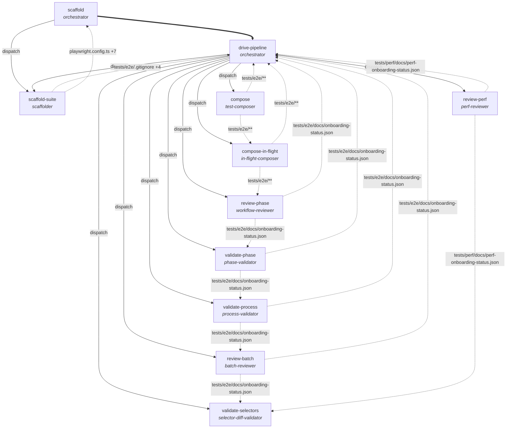

# achilles-qa — role ledger

Generated by `kernel-mandate doc` from `hooks/data/achilles-qa.kernel-mandate.json` and `hooks/data/achilles-qa.workflow.json`.
This file is derived. Edit the manifest, then re-run the command — an
edit here changes nothing about what is enforced.

## What this is

An operating system for agents working in this project: **10 roles**,
each with its own tools, paths, commands and dispatch rights. The kernel
(`kernel-mandate-role-gate.sh`) runs as a `PreToolUse` hook on every tool
call, resolves which role is making it, and refuses anything the manifest
does not grant. Rules that would otherwise be prose in a prompt — "the
reviewer only reads the deliverable" — are tool-call denials here.

- **Main session** — bound to `orchestrator`. Everything you type in this session is held to that role.
- **A subagent that binds to no role** — `readonly` (it may read, and nothing else).
- **Role tag corroboration** — `auto`: how hard a subagent's claimed role must be corroborated before the kernel believes it.
- **Scope** — the manifest governs the directory tree it sits in. Nothing outside it is touched, and nothing outside it is protected.

## Roles at a glance

| role | mandate | reads | writes | runs | dispatches |
|---|---|---|---|---|---|
| **batch-reviewer** | Approver: reviews a batch of composed specs and records the batch verdict in tests/e2e/docs/onboarding-status.json. | `docs/**`<br>`tests/**` | `tests/e2e/docs/onboarding-status.json` | — | — |
| **in-flight-composer** | Same mandate as test-composer, for specs composed mid-pipeline (coverage-expansion passes, self-repair heals). | `docs/**`<br>`tests/**`<br>`tests/e2e/page-repository.json` | `tests/e2e/**` | `^npx playwright test\b` | — |
| **orchestrator**<br>*(main session)* | The main session driving the achilles QA pipeline: walks the app, records pipeline state under tests/** and .achilles/**, runs the suite, commits, and dispatches every subagent role. | `.achilles/**`<br>`.gitignore`<br>`README.md`<br>`docs/**`<br>`package.json`<br>`playwright.config.ts`<br>`tests/**` | `.achilles/**`<br>`.gitignore`<br>`tests/**` | `^npx playwright test --list\b`<br>`^git status\b`<br>`^git log\b`<br>`^git diff\b`<br>`^git add\b`<br>`^git commit\b`<br>`^npx playwright test\b`<br>`^npm test\b`<br>`^npm run test:repair\b` | `batch-reviewer`<br>`in-flight-composer`<br>`perf-reviewer`<br>`phase-validator`<br>`process-validator`<br>`scaffolder`<br>`selector-diff-validator`<br>`test-composer`<br>`workflow-reviewer` |
| **perf-reviewer** | Approver for the perf pipeline: reviews tests/perf/** deliverables and records the verdict in tests/perf/docs/perf-onboarding-status.json. | `docs/**`<br>`tests/perf/**` | `tests/perf/docs/perf-onboarding-status.json` | — | — |
| **phase-validator** | Approver: emits the per-phase greenlight into tests/e2e/docs/onboarding-status.json after checking the phase's deliverables on disk. | `docs/**`<br>`tests/**` | `tests/e2e/docs/onboarding-status.json` | — | — |
| **process-validator** | Approver: validates that the pipeline followed the documented process and records the finding in tests/e2e/docs/onboarding-status.json. | `docs/**`<br>`tests/**` | `tests/e2e/docs/onboarding-status.json` | — | — |
| **scaffolder** | Write-only author of the Phase 1-2 scaffold: playwright.config.ts, package.json scripts, .gitignore entries, tests/e2e/playwright.setup.ts, tests/e2e/fixtures/**, tests/e2e/docs/app-context.md and tests/e2e/page-repository.json. | `.gitignore`<br>`README.md`<br>`docs/**`<br>`package.json`<br>`playwright.config.ts`<br>`tests/e2e/**` | `.gitignore`<br>`package.json`<br>`playwright.config.ts`<br>`tests/e2e/.gitignore`<br>`tests/e2e/docs/app-context.md`<br>`tests/e2e/fixtures/**`<br>`tests/e2e/page-repository.json`<br>`tests/e2e/playwright.setup.ts` | — | — |
| **selector-diff-validator** | Read-only validator: compares selector changes across tests/** and reports. | `tests/**` | — | — | — |
| **test-composer** | Authors Playwright specs under tests/e2e/** from a journey brief and self-verifies them with the runner. | `docs/**`<br>`tests/**`<br>`tests/e2e/page-repository.json` | `tests/e2e/**` | `^npx playwright test\b` | — |
| **workflow-reviewer** | Approver: reviews a phase's deliverables against the ledger and records the verdict in tests/e2e/docs/onboarding-status.json. | `docs/**`<br>`tests/**` | `tests/e2e/docs/onboarding-status.json` | — | — |

## Each role, and what it is refused

### `batch-reviewer`

Approver: reviews a batch of composed specs and records the batch verdict in tests/e2e/docs/onboarding-status.json. Reads only; no shell.

- **Binds when** the host dispatches an agent of type `batch-reviewer`, or when the brief carries `<<kernel-mandate-role: batch-reviewer#<nonce>>>` and the description begins `batch-reviewer-<slug>:`.
- **Tools** `Edit`, `Glob`, `Grep`, `Read`, `Skill`, `Write`
- **Reads** `docs/**`, `tests/**`
- **Writes** `tests/e2e/docs/onboarding-status.json`
- **Skills** `workflow-reviewer`

**May not** 
- use `Agent`, `Bash`
- run any shell command
- dispatch any subagent
- reach any network destination

### `in-flight-composer`

Same mandate as test-composer, for specs composed mid-pipeline (coverage-expansion passes, self-repair heals).

- **Binds when** the host dispatches an agent of type `in-flight-composer`, or when the brief carries `<<kernel-mandate-role: in-flight-composer#<nonce>>>` and the description begins `in-flight-composer-<slug>:`.
- **Tools** `Bash`, `Edit`, `Glob`, `Grep`, `Read`, `Skill`, `Write`
- **Reads** `docs/**`, `tests/**`, `tests/e2e/page-repository.json`
- **Writes** `tests/e2e/**`
- **Authored code may import** `@civitas-cerebrum/element-interactions`, `@playwright/test`
- **Runs** `^npx playwright test\b` — anchored patterns; a command that does not match is refused.
- **Reaches** `localhost`
- **Skills** `achilles-protocol`, `database-testing`, `selector-development`, `test-composer`, `test-data-conventions`

**May not** 
- use `Agent`
- dispatch any subagent

### `orchestrator` — the main session

The main session driving the achilles QA pipeline: walks the app, records pipeline state under tests/** and .achilles/**, runs the suite, commits, and dispatches every subagent role. It authors no runner or resolution config — playwright.config.ts, package.json and the Phase 1-2 scaffold (fixtures, setup, page repository, app context) are written by the scaffolder role it dispatches. Never touches application source or secrets.

- **Binds when** the host dispatches an agent of type `orchestrator`, or when the brief carries `<<kernel-mandate-role: orchestrator#<nonce>>>` and the description begins `orchestrator-<slug>:`.
- **Tools** `Agent`, `Bash`, `Edit`, `Glob`, `Grep`, `Read`, `Skill`, `Write`
- **Reads** `.achilles/**`, `.gitignore`, `README.md`, `docs/**`, `package.json`, `playwright.config.ts`, `tests/**`
- **Writes** `.achilles/**`, `.gitignore`, `tests/**`
- **Authored code may import** **nothing by name** (relative imports inside its own scope still work)
- **Runs** `^npx playwright test --list\b`, `^git status\b`, `^git log\b`, `^git diff\b`, `^git add\b`, `^git commit\b`, `^npx playwright test\b`, `^npm test\b`, `^npm run test:repair\b` — anchored patterns; a command that does not match is refused.
- **Reaches** `localhost:3000`, `localhost:4173`
- **Skills** `achilles-protocol`, `agents-vs-agents`, `bug-discovery`, `bug-report`, `companion-mode`, `contract-testing`, `contributing-to-achilles-protocol`, `coverage-expansion`, `database-testing`, `failure-diagnosis`, `journey-mapping`, `onboarding`, `perf-onboarding`, `performance-testing`, `secrets-sweep`, `selector-development`, `self-repair`, `test-catalogue`, `test-composer`, `test-data-conventions`, `test-repair`, `ticket-driven-testing`, `work-summary-deck`, `workflow-reviewer`
- **Dispatches** `batch-reviewer`, `in-flight-composer`, `perf-reviewer`, `phase-validator`, `process-validator`, `scaffolder`, `selector-diff-validator`, `test-composer`, `workflow-reviewer`

**May not** 
- (nothing beyond the universal refusals below)

### `perf-reviewer`

Approver for the perf pipeline: reviews tests/perf/** deliverables and records the verdict in tests/perf/docs/perf-onboarding-status.json. Reads only; no shell.

- **Binds when** the host dispatches an agent of type `perf-reviewer`, or when the brief carries `<<kernel-mandate-role: perf-reviewer#<nonce>>>` and the description begins `perf-reviewer-<slug>:`.
- **Tools** `Edit`, `Glob`, `Grep`, `Read`, `Skill`, `Write`
- **Reads** `docs/**`, `tests/perf/**`
- **Writes** `tests/perf/docs/perf-onboarding-status.json`
- **Skills** `workflow-reviewer`

**May not** 
- use `Agent`, `Bash`
- run any shell command
- dispatch any subagent
- reach any network destination
- see what `batch-reviewer` writes (`tests/e2e/docs/onboarding-status.json`)
- see what `in-flight-composer` writes (`tests/e2e/**`)
- see what `phase-validator` writes (`tests/e2e/docs/onboarding-status.json`)
- see what `process-validator` writes (`tests/e2e/docs/onboarding-status.json`)
- see what `scaffolder` writes (`.gitignore`, `package.json`, `playwright.config.ts`, `tests/e2e/.gitignore`, `tests/e2e/docs/app-context.md`, `tests/e2e/fixtures/**`, `tests/e2e/page-repository.json`, `tests/e2e/playwright.setup.ts`)
- see what `test-composer` writes (`tests/e2e/**`)
- see what `workflow-reviewer` writes (`tests/e2e/docs/onboarding-status.json`)

### `phase-validator`

Approver: emits the per-phase greenlight into tests/e2e/docs/onboarding-status.json after checking the phase's deliverables on disk. Reads only; no shell.

- **Binds when** the host dispatches an agent of type `phase-validator`, or when the brief carries `<<kernel-mandate-role: phase-validator#<nonce>>>` and the description begins `phase-validator-<slug>:`.
- **Tools** `Edit`, `Glob`, `Grep`, `Read`, `Skill`, `Write`
- **Reads** `docs/**`, `tests/**`
- **Writes** `tests/e2e/docs/onboarding-status.json`
- **Skills** `workflow-reviewer`

**May not** 
- use `Agent`, `Bash`
- run any shell command
- dispatch any subagent
- reach any network destination

### `process-validator`

Approver: validates that the pipeline followed the documented process and records the finding in tests/e2e/docs/onboarding-status.json. Reads only; no shell.

- **Binds when** the host dispatches an agent of type `process-validator`, or when the brief carries `<<kernel-mandate-role: process-validator#<nonce>>>` and the description begins `process-validator-<slug>:`.
- **Tools** `Edit`, `Glob`, `Grep`, `Read`, `Skill`, `Write`
- **Reads** `docs/**`, `tests/**`
- **Writes** `tests/e2e/docs/onboarding-status.json`
- **Skills** `workflow-reviewer`

**May not** 
- use `Agent`, `Bash`
- run any shell command
- dispatch any subagent
- reach any network destination

### `scaffolder`

Write-only author of the Phase 1-2 scaffold: playwright.config.ts, package.json scripts, .gitignore entries, tests/e2e/playwright.setup.ts, tests/e2e/fixtures/**, tests/e2e/docs/app-context.md and tests/e2e/page-repository.json. No shell and no dispatch — the orchestrator runs `npx playwright test --list` to verify what it wrote, so the role that authors the runner's config never runs the runner.

- **Binds when** the host dispatches an agent of type `scaffolder`, or when the brief carries `<<kernel-mandate-role: scaffolder#<nonce>>>` and the description begins `scaffolder-<slug>:`.
- **Tools** `Edit`, `Glob`, `Grep`, `Read`, `Skill`, `Write`
- **Reads** `.gitignore`, `README.md`, `docs/**`, `package.json`, `playwright.config.ts`, `tests/e2e/**`
- **Writes** `.gitignore`, `package.json`, `playwright.config.ts`, `tests/e2e/.gitignore`, `tests/e2e/docs/app-context.md`, `tests/e2e/fixtures/**`, `tests/e2e/page-repository.json`, `tests/e2e/playwright.setup.ts`
- **Skills** `achilles-protocol`

**May not** 
- use `Agent`, `Bash`
- run any shell command
- dispatch any subagent
- reach any network destination
- see what `perf-reviewer` writes (`tests/perf/docs/perf-onboarding-status.json`)

### `selector-diff-validator`

Read-only validator: compares selector changes across tests/** and reports. Writes nothing; no shell.

- **Binds when** the host dispatches an agent of type `selector-diff-validator`, or when the brief carries `<<kernel-mandate-role: selector-diff-validator#<nonce>>>` and the description begins `selector-diff-validator-<slug>:`.
- **Tools** `Glob`, `Grep`, `Read`
- **Reads** `tests/**`
- **Writes** —

**May not** 
- use `Agent`, `Bash`, `Edit`, `Skill`, `Write`
- write any file — it has no write grants
- run any shell command
- dispatch any subagent
- reach any network destination
- invoke any skill

### `test-composer`

Authors Playwright specs under tests/e2e/** from a journey brief and self-verifies them with the runner. Reads the page repository and docs; writes nothing outside tests/e2e/**.

- **Binds when** the host dispatches an agent of type `test-composer`, or when the brief carries `<<kernel-mandate-role: test-composer#<nonce>>>` and the description begins `test-composer-<slug>:`.
- **Tools** `Bash`, `Edit`, `Glob`, `Grep`, `Read`, `Skill`, `Write`
- **Reads** `docs/**`, `tests/**`, `tests/e2e/page-repository.json`
- **Writes** `tests/e2e/**`
- **Authored code may import** `@civitas-cerebrum/element-interactions`, `@playwright/test`
- **Runs** `^npx playwright test\b` — anchored patterns; a command that does not match is refused.
- **Reaches** `localhost`
- **Skills** `achilles-protocol`, `database-testing`, `selector-development`, `test-composer`, `test-data-conventions`

**May not** 
- use `Agent`
- dispatch any subagent

### `workflow-reviewer`

Approver: reviews a phase's deliverables against the ledger and records the verdict in tests/e2e/docs/onboarding-status.json. Reads only; no shell.

- **Binds when** the host dispatches an agent of type `workflow-reviewer`, or when the brief carries `<<kernel-mandate-role: workflow-reviewer#<nonce>>>` and the description begins `workflow-reviewer-<slug>:`.
- **Tools** `Edit`, `Glob`, `Grep`, `Read`, `Skill`, `Write`
- **Reads** `docs/**`, `tests/**`
- **Writes** `tests/e2e/docs/onboarding-status.json`
- **Skills** `workflow-reviewer`

**May not** 
- use `Agent`, `Bash`
- run any shell command
- dispatch any subagent
- reach any network destination

## Handover contracts

Work changes hands through the filesystem: one role writes a path,
another reads it. Every row below is a contract the kernel enforces from
both ends — the writer may write it, the reader may read it, and no one
else can do either.

| from | to | what changes hands |
|---|---|---|
| `batch-reviewer` | `in-flight-composer` | `tests/e2e/docs/onboarding-status.json` |
| `batch-reviewer` | `orchestrator` | `tests/e2e/docs/onboarding-status.json` |
| `batch-reviewer` | `phase-validator` | `tests/e2e/docs/onboarding-status.json` |
| `batch-reviewer` | `process-validator` | `tests/e2e/docs/onboarding-status.json` |
| `batch-reviewer` | `scaffolder` | `tests/e2e/docs/onboarding-status.json` |
| `batch-reviewer` | `selector-diff-validator` | `tests/e2e/docs/onboarding-status.json` |
| `batch-reviewer` | `test-composer` | `tests/e2e/docs/onboarding-status.json` |
| `batch-reviewer` | `workflow-reviewer` | `tests/e2e/docs/onboarding-status.json` |
| `in-flight-composer` | `batch-reviewer` | `tests/e2e/**` |
| `in-flight-composer` | `orchestrator` | `tests/e2e/**` |
| `in-flight-composer` | `phase-validator` | `tests/e2e/**` |
| `in-flight-composer` | `process-validator` | `tests/e2e/**` |
| `in-flight-composer` | `scaffolder` | `tests/e2e/**` |
| `in-flight-composer` | `selector-diff-validator` | `tests/e2e/**` |
| `in-flight-composer` | `test-composer` | `tests/e2e/**` |
| `in-flight-composer` | `workflow-reviewer` | `tests/e2e/**` |
| `orchestrator` | `batch-reviewer` | `tests/**` |
| `orchestrator` | `in-flight-composer` | `tests/**` |
| `orchestrator` | `perf-reviewer` | `tests/**` |
| `orchestrator` | `phase-validator` | `tests/**` |
| `orchestrator` | `process-validator` | `tests/**` |
| `orchestrator` | `scaffolder` | `.gitignore`, `tests/**` |
| `orchestrator` | `selector-diff-validator` | `tests/**` |
| `orchestrator` | `test-composer` | `tests/**` |
| `orchestrator` | `workflow-reviewer` | `tests/**` |
| `perf-reviewer` | `batch-reviewer` | `tests/perf/docs/perf-onboarding-status.json` |
| `perf-reviewer` | `in-flight-composer` | `tests/perf/docs/perf-onboarding-status.json` |
| `perf-reviewer` | `orchestrator` | `tests/perf/docs/perf-onboarding-status.json` |
| `perf-reviewer` | `phase-validator` | `tests/perf/docs/perf-onboarding-status.json` |
| `perf-reviewer` | `process-validator` | `tests/perf/docs/perf-onboarding-status.json` |
| `perf-reviewer` | `selector-diff-validator` | `tests/perf/docs/perf-onboarding-status.json` |
| `perf-reviewer` | `test-composer` | `tests/perf/docs/perf-onboarding-status.json` |
| `perf-reviewer` | `workflow-reviewer` | `tests/perf/docs/perf-onboarding-status.json` |
| `phase-validator` | `batch-reviewer` | `tests/e2e/docs/onboarding-status.json` |
| `phase-validator` | `in-flight-composer` | `tests/e2e/docs/onboarding-status.json` |
| `phase-validator` | `orchestrator` | `tests/e2e/docs/onboarding-status.json` |
| `phase-validator` | `process-validator` | `tests/e2e/docs/onboarding-status.json` |
| `phase-validator` | `scaffolder` | `tests/e2e/docs/onboarding-status.json` |
| `phase-validator` | `selector-diff-validator` | `tests/e2e/docs/onboarding-status.json` |
| `phase-validator` | `test-composer` | `tests/e2e/docs/onboarding-status.json` |
| `phase-validator` | `workflow-reviewer` | `tests/e2e/docs/onboarding-status.json` |
| `process-validator` | `batch-reviewer` | `tests/e2e/docs/onboarding-status.json` |
| `process-validator` | `in-flight-composer` | `tests/e2e/docs/onboarding-status.json` |
| `process-validator` | `orchestrator` | `tests/e2e/docs/onboarding-status.json` |
| `process-validator` | `phase-validator` | `tests/e2e/docs/onboarding-status.json` |
| `process-validator` | `scaffolder` | `tests/e2e/docs/onboarding-status.json` |
| `process-validator` | `selector-diff-validator` | `tests/e2e/docs/onboarding-status.json` |
| `process-validator` | `test-composer` | `tests/e2e/docs/onboarding-status.json` |
| `process-validator` | `workflow-reviewer` | `tests/e2e/docs/onboarding-status.json` |
| `scaffolder` | `batch-reviewer` | `tests/e2e/.gitignore`, `tests/e2e/docs/app-context.md`, `tests/e2e/fixtures/**`, `tests/e2e/page-repository.json`, `tests/e2e/playwright.setup.ts` |
| `scaffolder` | `in-flight-composer` | `tests/e2e/.gitignore`, `tests/e2e/docs/app-context.md`, `tests/e2e/fixtures/**`, `tests/e2e/page-repository.json`, `tests/e2e/playwright.setup.ts` |
| `scaffolder` | `orchestrator` | `.gitignore`, `package.json`, `playwright.config.ts`, `tests/e2e/.gitignore`, `tests/e2e/docs/app-context.md`, `tests/e2e/fixtures/**`, `tests/e2e/page-repository.json`, `tests/e2e/playwright.setup.ts` |
| `scaffolder` | `phase-validator` | `tests/e2e/.gitignore`, `tests/e2e/docs/app-context.md`, `tests/e2e/fixtures/**`, `tests/e2e/page-repository.json`, `tests/e2e/playwright.setup.ts` |
| `scaffolder` | `process-validator` | `tests/e2e/.gitignore`, `tests/e2e/docs/app-context.md`, `tests/e2e/fixtures/**`, `tests/e2e/page-repository.json`, `tests/e2e/playwright.setup.ts` |
| `scaffolder` | `selector-diff-validator` | `tests/e2e/.gitignore`, `tests/e2e/docs/app-context.md`, `tests/e2e/fixtures/**`, `tests/e2e/page-repository.json`, `tests/e2e/playwright.setup.ts` |
| `scaffolder` | `test-composer` | `tests/e2e/.gitignore`, `tests/e2e/docs/app-context.md`, `tests/e2e/fixtures/**`, `tests/e2e/page-repository.json`, `tests/e2e/playwright.setup.ts` |
| `scaffolder` | `workflow-reviewer` | `tests/e2e/.gitignore`, `tests/e2e/docs/app-context.md`, `tests/e2e/fixtures/**`, `tests/e2e/page-repository.json`, `tests/e2e/playwright.setup.ts` |
| `test-composer` | `batch-reviewer` | `tests/e2e/**` |
| `test-composer` | `in-flight-composer` | `tests/e2e/**` |
| `test-composer` | `orchestrator` | `tests/e2e/**` |
| `test-composer` | `phase-validator` | `tests/e2e/**` |
| `test-composer` | `process-validator` | `tests/e2e/**` |
| `test-composer` | `scaffolder` | `tests/e2e/**` |
| `test-composer` | `selector-diff-validator` | `tests/e2e/**` |
| `test-composer` | `workflow-reviewer` | `tests/e2e/**` |
| `workflow-reviewer` | `batch-reviewer` | `tests/e2e/docs/onboarding-status.json` |
| `workflow-reviewer` | `in-flight-composer` | `tests/e2e/docs/onboarding-status.json` |
| `workflow-reviewer` | `orchestrator` | `tests/e2e/docs/onboarding-status.json` |
| `workflow-reviewer` | `phase-validator` | `tests/e2e/docs/onboarding-status.json` |
| `workflow-reviewer` | `process-validator` | `tests/e2e/docs/onboarding-status.json` |
| `workflow-reviewer` | `scaffolder` | `tests/e2e/docs/onboarding-status.json` |
| `workflow-reviewer` | `selector-diff-validator` | `tests/e2e/docs/onboarding-status.json` |
| `workflow-reviewer` | `test-composer` | `tests/e2e/docs/onboarding-status.json` |

### Dispatch

A dispatch is the other handover. It binds only when the brief says which
role is being summoned, in this grammar:

```
description:  <role>-<slug>: <one line of task>
brief line 1: <<kernel-mandate-role: <role>#<nonce>>>
subagent_type: <role>            (when the host supplies agent types)
```

The nonce is fresh per dispatch. A brief without the tag, or naming a role
the dispatcher may not summon, is refused at the `Agent` call — before the
child exists.

- `orchestrator` may summon `batch-reviewer`, `in-flight-composer`, `perf-reviewer`, `phase-validator`, `process-validator`, `scaffolder`, `selector-diff-validator`, `test-composer`, `workflow-reviewer`

## The workflow

Each box is a stage: what happens, and the role that holds it. The
thick arrows are the phase order the driving session moves through;
plain arrows are dispatches; dotted arrows are handovers, labelled with
the path that changes hands: where the work goes next, and where a
result returns to the stage that dispatched it. The table below carries
every path in full.



| stage | role | reads | writes | runs | dispatches |
|---|---|---|---|---|---|
| **scaffold** | `orchestrator` | `tests/**`<br>`docs/**`<br>`package.json`<br>`playwright.config.ts`<br>`.gitignore`<br>`README.md`<br>`.achilles/**` | `tests/**`<br>`.gitignore`<br>`.achilles/**` | `npx playwright test --list`<br>`git status`<br>`git log`<br>`git diff`<br>`git add`<br>`git commit` | `scaffolder` |
| **scaffold-suite** | `scaffolder` | `tests/e2e/**`<br>`docs/**`<br>`package.json`<br>`playwright.config.ts`<br>`.gitignore`<br>`README.md` | `playwright.config.ts`<br>`package.json`<br>`.gitignore`<br>`tests/e2e/.gitignore`<br>`tests/e2e/playwright.setup.ts`<br>`tests/e2e/fixtures/**`<br>`tests/e2e/docs/app-context.md`<br>`tests/e2e/page-repository.json` | — | — |
| **drive-pipeline** | `orchestrator` | `tests/**`<br>`docs/**`<br>`.achilles/**` | `tests/**`<br>`.achilles/**` | `npx playwright test`<br>`npm test`<br>`npm run test:repair` | `scaffolder`<br>`test-composer`<br>`in-flight-composer`<br>`workflow-reviewer`<br>`phase-validator`<br>`process-validator`<br>`batch-reviewer`<br>`perf-reviewer`<br>`selector-diff-validator` |
| **compose** | `test-composer` | `tests/**`<br>`docs/**`<br>`tests/e2e/page-repository.json` | `tests/e2e/**` | `npx playwright test` | — |
| **compose-in-flight** | `in-flight-composer` | `tests/**`<br>`docs/**`<br>`tests/e2e/page-repository.json` | `tests/e2e/**` | `npx playwright test` | — |
| **review-phase** | `workflow-reviewer` | `tests/**`<br>`docs/**` | `tests/e2e/docs/onboarding-status.json` | — | — |
| **validate-phase** | `phase-validator` | `tests/**`<br>`docs/**` | `tests/e2e/docs/onboarding-status.json` | — | — |
| **validate-process** | `process-validator` | `tests/**`<br>`docs/**` | `tests/e2e/docs/onboarding-status.json` | — | — |
| **review-batch** | `batch-reviewer` | `tests/**`<br>`docs/**` | `tests/e2e/docs/onboarding-status.json` | — | — |
| **review-perf** | `perf-reviewer` | `tests/perf/**`<br>`docs/**` | `tests/perf/docs/perf-onboarding-status.json` | — | — |
| **validate-selectors** | `selector-diff-validator` | `tests/**` | — | — | — |

## Review loops

A loop is where work comes back for another pass: a verdict lands, the
role that planned the work reads it, and the work is dispatched again.
These are the loops this OS allows — anything else is a straight line.

- `batch-reviewer` → `in-flight-composer` → `batch-reviewer`
- `batch-reviewer` → `orchestrator` → `batch-reviewer`
- `batch-reviewer` → `phase-validator` → `batch-reviewer`
- `batch-reviewer` → `process-validator` → `batch-reviewer`
- `batch-reviewer` → `scaffolder` → `batch-reviewer`
- `batch-reviewer` → `test-composer` → `batch-reviewer`
- `batch-reviewer` → `workflow-reviewer` → `batch-reviewer`
- `in-flight-composer` → `orchestrator` → `in-flight-composer`
- `in-flight-composer` → `phase-validator` → `in-flight-composer`
- `in-flight-composer` → `process-validator` → `in-flight-composer`

(191 longer loops exist, each a composition of the ones above.)

## What the kernel refuses for every role

These hold whatever the manifest says, and are not listed per role above:

- **Its own control surfaces** — the manifest, `.claude/settings.json`, the hooks, `.claude/agents/`, `.mcp.json` and the kernel state directory. A role that could rewrite the rules has no rules.
- **Secrets** — `.env` and its relatives are outside every read scope unless a role is explicitly granted them, on the file channel and through the shell alike.
- **Re-anchoring** — `git -C`, `npm --prefix` and the rest of the family, which would run a permitted command somewhere else.
- **Constructed destinations** — authored code that builds a network target at run time (`fetch("htt"+"p://…")`, a dynamic `import`, `new WebSocket(host)`) rather than naming one.
- **Deletion is a write** — `rm`, `rmdir` and `unlink` are held to write scope.
- **Failing closed** — if the kernel itself faults, the call is denied, not allowed.

### What it does not check

- **The dispatch brief.** What a dispatcher pastes into a child's brief is bounded only by what the dispatcher itself may read. Path scopes bound the filesystem, not the conversation.
- **Field-level rules.** "Only a judge may set `verdict: green`" is not a path scope; it belongs in a hook of your own.
- **Runtime behaviour of authored code.** The import and capability screens read the text a role writes; they are not a sandbox.

