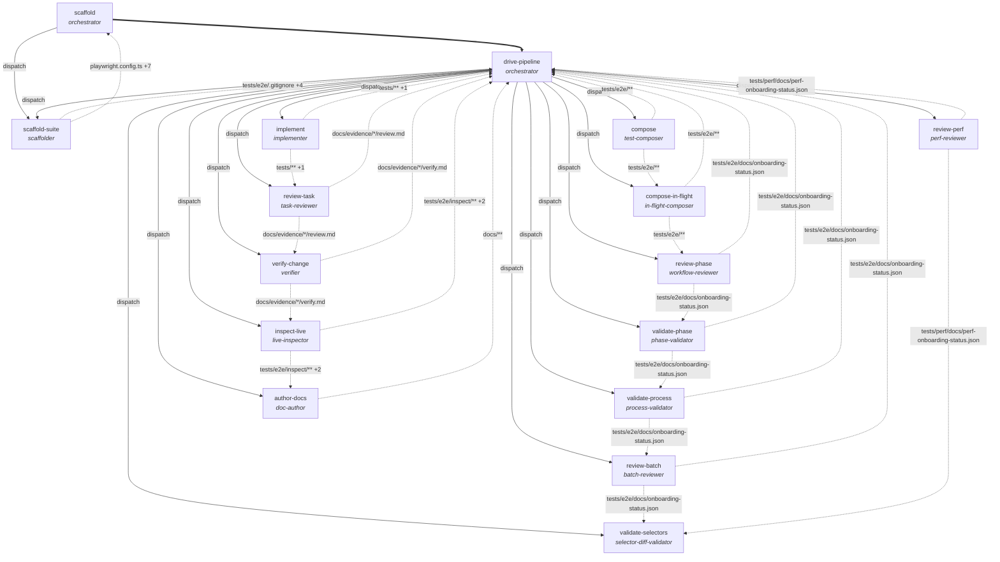

# achilles-qa — role ledger

Generated by `kernel-mandate doc` from `hooks/data/achilles-qa.kernel-mandate.json` and `hooks/data/achilles-qa.workflow.json`.
This file is derived. Edit the manifest, then re-run the command — an
edit here changes nothing about what is enforced.

## What this is

An operating system for agents working in this project: **15 roles**,
each with its own tools, paths, commands and dispatch rights. The kernel
(`kernel-mandate-role-gate.sh`) runs as a `PreToolUse` hook on every tool
call, resolves which role is making it, and refuses anything the manifest
does not grant. Rules that would otherwise be prose in a prompt — "the
reviewer only reads the deliverable" — are tool-call denials here.

- **Main session** — bound to `orchestrator`. Everything you type in this session is held to that role.
- **A subagent that binds to no role** — `readonly` (it may read, and nothing else).
- **Role tag corroboration** — `auto`: how hard a subagent's claimed role must be corroborated before the kernel believes it.
- **Scope** — the manifest governs the directory tree it sits in. Nothing outside it is touched, and nothing outside it is protected.

## Roles at a glance

| role | mandate | reads | writes | runs | dispatches |
|---|---|---|---|---|---|
| **batch-reviewer** | Approver: reviews a batch of composed specs and records the batch verdict in tests/e2e/docs/onboarding-status.json. | `docs/**`<br>`tests/**` | `tests/e2e/docs/onboarding-status.json` | — | — |
| **doc-author** | Writes documentation only: docs/** (except the evidence trail docs/evidence/**), CLAUDE.md and project skills under .claude/skills/**. | `.claude/skills/**`<br>`CLAUDE.md`<br>`README.md`<br>`docs/**`<br>`tests/**` | `.claude/skills/**`<br>`CLAUDE.md`<br>`docs/**`<br>*except* `docs/evidence/**` | — | — |
| **implementer** | Writes one change: specs, fixtures and support code under tests/** (never the page repository, which live inspection owns) and the change report (report.md in the change's folder under docs/evidence/). | `docs/**`<br>`package.json`<br>`playwright.config.ts`<br>`tests/**` | `docs/evidence/*/report.md`<br>`tests/**`<br>*except* `**/page-repository*.json`<br>`tests/e2e/docs/onboarding-status.json` | `^npx playwright test\b`<br>`^npx tsc --noEmit\b`<br>`^npm run test:unit\b` | — |
| **in-flight-composer** | Same mandate as test-composer, for specs composed mid-pipeline (coverage-expansion passes, self-repair heals). | `docs/**`<br>`tests/**`<br>`tests/e2e/page-repository.json` | `tests/e2e/**` | `^npx playwright test\b` | — |
| **live-inspector** | Inspects the running app before any selector exists: writes throwaway inspection specs under the inspect dir (tests/e2e/inspect/**, deleted before hand-back), selector evidence under docs/evidence/selectors/** and a proposal note in the change's folder under docs/evidence/. | `docs/**`<br>`tests/**`<br>`tests/e2e/page-repository.json` | `docs/evidence/*/proposal-*.md`<br>`docs/evidence/selectors/**`<br>`tests/e2e/inspect/**` | `^npx playwright test --config tests/e2e/inspect\b`<br>`^npx achilles-selector-evidence\b` | — |
| **orchestrator**<br>*(main session)* | The main session driving the achilles QA pipeline: walks the app, records pipeline state under tests/** and .achilles/**, runs the suite, commits, and dispatches every subagent role. | `.achilles/**`<br>`.gitignore`<br>`README.md`<br>`docs/**`<br>`package.json`<br>`playwright.config.ts`<br>`tests/**` | `.achilles/**`<br>`.gitignore`<br>`docs/evidence/*/brief.md`<br>`docs/evidence/*/review-package.md`<br>`tests/**` | `^npx playwright test --list\b`<br>`^git status\b`<br>`^git log\b`<br>`^git diff\b`<br>`^git add\b`<br>`^git commit\b`<br>`^npx playwright test\b`<br>`^npm test\b`<br>`^npm run test:repair\b`<br>`^npm run verify\b`<br>`^npm run change:start\b` | `batch-reviewer`<br>`doc-author`<br>`implementer`<br>`in-flight-composer`<br>`live-inspector`<br>`perf-reviewer`<br>`phase-validator`<br>`process-validator`<br>`scaffolder`<br>`selector-diff-validator`<br>`task-reviewer`<br>`test-composer`<br>`verifier`<br>`workflow-reviewer` |
| **perf-reviewer** | Approver for the perf pipeline: reviews tests/perf/** deliverables and records the verdict in tests/perf/docs/perf-onboarding-status.json. | `docs/**`<br>`tests/perf/**` | `tests/perf/docs/perf-onboarding-status.json` | — | — |
| **phase-validator** | Approver: emits the per-phase greenlight into tests/e2e/docs/onboarding-status.json after checking the phase's deliverables on disk. | `docs/**`<br>`tests/**` | `tests/e2e/docs/onboarding-status.json` | — | — |
| **process-validator** | Approver: validates that the pipeline followed the documented process and records the finding in tests/e2e/docs/onboarding-status.json. | `docs/**`<br>`tests/**` | `tests/e2e/docs/onboarding-status.json` | — | — |
| **scaffolder** | Write-only author of the Phase 1-2 scaffold: playwright.config.ts, package.json scripts, .gitignore entries, tests/e2e/playwright.setup.ts, tests/e2e/fixtures/**, tests/e2e/docs/app-context.md and tests/e2e/page-repository.json. | `.gitignore`<br>`README.md`<br>`docs/**`<br>`package.json`<br>`playwright.config.ts`<br>`tests/e2e/**` | `.gitignore`<br>`package.json`<br>`playwright.config.ts`<br>`tests/e2e/.gitignore`<br>`tests/e2e/docs/app-context.md`<br>`tests/e2e/fixtures/**`<br>`tests/e2e/page-repository.json`<br>`tests/e2e/playwright.setup.ts` | — | — |
| **selector-diff-validator** | Read-only validator: compares selector changes across tests/** and reports. | `tests/**` | — | — | — |
| **task-reviewer** | Approver: reads the brief, the implementer's report and the review package for one change and records findings (Critical / Important / Minor, each with file:line and a fix) in review.md in the change's folder under docs/evidence/. | `docs/**`<br>`package.json`<br>`playwright.config.ts`<br>`tests/**` | `docs/evidence/*/review.md` | `^npx tsc --noEmit\b`<br>`^npm run test:unit\b`<br>`^npm run test:hooks\b` | — |
| **test-composer** | Authors Playwright specs under tests/e2e/** from a journey brief and self-verifies them with the runner. | `docs/**`<br>`tests/**`<br>`tests/e2e/page-repository.json` | `tests/e2e/**` | `^npx playwright test\b` | — |
| **verifier** | Approver: independently runs a change and records the verdict in verify.md in the change's folder under docs/evidence/; only it may set that note's Status: complete. | `docs/**`<br>`package.json`<br>`playwright.config.ts`<br>`tests/**` | `docs/evidence/*/verify.md` | `^npx playwright test\b`<br>`^npx tsc --noEmit\b`<br>`^npm run test:unit\b`<br>`^npm run test:hooks\b` | — |
| **workflow-reviewer** | Approver: reviews a phase's deliverables against the ledger and records the verdict in tests/e2e/docs/onboarding-status.json. | `docs/**`<br>`tests/**` | `tests/e2e/docs/onboarding-status.json` | — | — |

## Each role, and what it is refused

### `batch-reviewer`

Approver: reviews a batch of composed specs and records the batch verdict in tests/e2e/docs/onboarding-status.json. Reads only; no shell.

- **Binds when** the host dispatches an agent of type `batch-reviewer`, or when the brief carries `<<kernel-mandate-role: batch-reviewer#<nonce>>>` and the description begins `batch-reviewer-<slug>:`.
- **Tools** `Edit`, `Glob`, `Grep`, `Read`, `Skill`, `Write`
- **Reads** `docs/**`, `tests/**`
- **Writes** `tests/e2e/docs/onboarding-status.json`
- **Skills** `workflow-reviewer`

**May not** 
- use `Agent`, `Bash`
- run any shell command
- dispatch any subagent
- reach any network destination

### `doc-author`

Writes documentation only: docs/** (except the evidence trail docs/evidence/**), CLAUDE.md and project skills under .claude/skills/**. No shell, no dispatch, no authored code.

- **Binds when** the host dispatches an agent of type `doc-author`, or when the brief carries `<<kernel-mandate-role: doc-author#<nonce>>>` and the description begins `doc-author-<slug>:`.
- **Tools** `Edit`, `Glob`, `Grep`, `Read`, `Skill`, `Write`
- **Reads** `.claude/skills/**`, `CLAUDE.md`, `README.md`, `docs/**`, `tests/**`
- **Writes** `.claude/skills/**`, `CLAUDE.md`, `docs/**`
- **Never writes** `docs/evidence/**` — carved out of the write scope; deny beats allow.
- **Skills** `achilles-protocol`

**May not** 
- use `Agent`, `Bash`
- run any shell command
- dispatch any subagent
- reach any network destination

### `implementer`

Writes one change: specs, fixtures and support code under tests/** (never the page repository, which live inspection owns) and the change report (report.md in the change's folder under docs/evidence/). Proves its own work with the test runner on its own shard, the type check and the unit runner. Never reviews or verifies its own change and dispatches nothing.

- **Binds when** the host dispatches an agent of type `implementer`, or when the brief carries `<<kernel-mandate-role: implementer#<nonce>>>` and the description begins `implementer-<slug>:`.
- **Tools** `Bash`, `Edit`, `Glob`, `Grep`, `Read`, `Skill`, `Write`
- **Reads** `docs/**`, `package.json`, `playwright.config.ts`, `tests/**`
- **Writes** `docs/evidence/*/report.md`, `tests/**`
- **Never writes** `**/page-repository*.json`, `tests/e2e/docs/onboarding-status.json` — carved out of the write scope; deny beats allow.
- **Authored code may import** `@civitas-cerebrum/element-interactions`, `@playwright/test`
- **Runs** `^npx playwright test\b`, `^npx tsc --noEmit\b`, `^npm run test:unit\b` — anchored patterns; a command that does not match is refused.
- **Reaches** `localhost`
- **Skills** `achilles-protocol`, `contract-testing`, `database-testing`, `failure-diagnosis`, `test-composer`, `test-data-conventions`

**May not** 
- use `Agent`
- dispatch any subagent

### `in-flight-composer`

Same mandate as test-composer, for specs composed mid-pipeline (coverage-expansion passes, self-repair heals).

- **Binds when** the host dispatches an agent of type `in-flight-composer`, or when the brief carries `<<kernel-mandate-role: in-flight-composer#<nonce>>>` and the description begins `in-flight-composer-<slug>:`.
- **Tools** `Bash`, `Edit`, `Glob`, `Grep`, `Read`, `Skill`, `Write`
- **Reads** `docs/**`, `tests/**`, `tests/e2e/page-repository.json`
- **Writes** `tests/e2e/**`
- **Authored code may import** `@civitas-cerebrum/element-interactions`, `@playwright/test`
- **Runs** `^npx playwright test\b` — anchored patterns; a command that does not match is refused.
- **Reaches** `localhost`
- **Skills** `achilles-protocol`, `database-testing`, `selector-development`, `test-composer`, `test-data-conventions`

**May not** 
- use `Agent`
- dispatch any subagent

### `live-inspector`

Inspects the running app before any selector exists: writes throwaway inspection specs under the inspect dir (tests/e2e/inspect/**, deleted before hand-back), selector evidence under docs/evidence/selectors/** and a proposal note in the change's folder under docs/evidence/. Proposes; never edits the page repository, specs or fixtures.

- **Binds when** the host dispatches an agent of type `live-inspector`, or when the brief carries `<<kernel-mandate-role: live-inspector#<nonce>>>` and the description begins `live-inspector-<slug>:`.
- **Tools** `Bash`, `Edit`, `Glob`, `Grep`, `Read`, `Skill`, `Write`
- **Reads** `docs/**`, `tests/**`, `tests/e2e/page-repository.json`
- **Writes** `docs/evidence/*/proposal-*.md`, `docs/evidence/selectors/**`, `tests/e2e/inspect/**`
- **Authored code may import** `@civitas-cerebrum/element-interactions`, `@playwright/test`
- **Runs** `^npx playwright test --config tests/e2e/inspect\b`, `^npx achilles-selector-evidence\b` — anchored patterns; a command that does not match is refused.
- **Reaches** `localhost`
- **Skills** `achilles-protocol`

**May not** 
- use `Agent`
- dispatch any subagent

### `orchestrator` — the main session

The main session driving the achilles QA pipeline: walks the app, records pipeline state under tests/** and .achilles/**, runs the suite, commits, and dispatches every subagent role. It authors no runner or resolution config — playwright.config.ts, package.json and the Phase 1-2 scaffold (fixtures, setup, page repository, app context) are written by the scaffolder role it dispatches. Never touches application source or secrets.

- **Binds when** the host dispatches an agent of type `orchestrator`, or when the brief carries `<<kernel-mandate-role: orchestrator#<nonce>>>` and the description begins `orchestrator-<slug>:`.
- **Tools** `Agent`, `Bash`, `Edit`, `Glob`, `Grep`, `Read`, `Skill`, `Write`
- **Reads** `.achilles/**`, `.gitignore`, `README.md`, `docs/**`, `package.json`, `playwright.config.ts`, `tests/**`
- **Writes** `.achilles/**`, `.gitignore`, `docs/evidence/*/brief.md`, `docs/evidence/*/review-package.md`, `tests/**`
- **Authored code may import** **nothing by name** (relative imports inside its own scope still work)
- **Runs** `^npx playwright test --list\b`, `^git status\b`, `^git log\b`, `^git diff\b`, `^git add\b`, `^git commit\b`, `^npx playwright test\b`, `^npm test\b`, `^npm run test:repair\b`, `^npm run verify\b`, `^npm run change:start\b` — anchored patterns; a command that does not match is refused.
- **Reaches** `localhost:3000`, `localhost:4173`
- **Skills** `achilles-protocol`, `agents-vs-agents`, `bug-discovery`, `bug-report`, `companion-mode`, `contract-testing`, `contributing-to-achilles-protocol`, `coverage-expansion`, `database-testing`, `failure-diagnosis`, `journey-mapping`, `onboarding`, `perf-onboarding`, `performance-testing`, `secrets-sweep`, `selector-development`, `self-repair`, `test-catalogue`, `test-composer`, `test-data-conventions`, `test-repair`, `ticket-driven-testing`, `work-summary-deck`, `workflow-reviewer`
- **Dispatches** `batch-reviewer`, `doc-author`, `implementer`, `in-flight-composer`, `live-inspector`, `perf-reviewer`, `phase-validator`, `process-validator`, `scaffolder`, `selector-diff-validator`, `task-reviewer`, `test-composer`, `verifier`, `workflow-reviewer`

**May not** 
- (nothing beyond the universal refusals below)

### `perf-reviewer`

Approver for the perf pipeline: reviews tests/perf/** deliverables and records the verdict in tests/perf/docs/perf-onboarding-status.json. Reads only; no shell.

- **Binds when** the host dispatches an agent of type `perf-reviewer`, or when the brief carries `<<kernel-mandate-role: perf-reviewer#<nonce>>>` and the description begins `perf-reviewer-<slug>:`.
- **Tools** `Edit`, `Glob`, `Grep`, `Read`, `Skill`, `Write`
- **Reads** `docs/**`, `tests/perf/**`
- **Writes** `tests/perf/docs/perf-onboarding-status.json`
- **Skills** `workflow-reviewer`

**May not** 
- use `Agent`, `Bash`
- run any shell command
- dispatch any subagent
- reach any network destination
- see what `batch-reviewer` writes (`tests/e2e/docs/onboarding-status.json`)
- see what `in-flight-composer` writes (`tests/e2e/**`)
- see what `phase-validator` writes (`tests/e2e/docs/onboarding-status.json`)
- see what `process-validator` writes (`tests/e2e/docs/onboarding-status.json`)
- see what `scaffolder` writes (`.gitignore`, `package.json`, `playwright.config.ts`, `tests/e2e/.gitignore`, `tests/e2e/docs/app-context.md`, `tests/e2e/fixtures/**`, `tests/e2e/page-repository.json`, `tests/e2e/playwright.setup.ts`)
- see what `test-composer` writes (`tests/e2e/**`)
- see what `workflow-reviewer` writes (`tests/e2e/docs/onboarding-status.json`)

### `phase-validator`

Approver: emits the per-phase greenlight into tests/e2e/docs/onboarding-status.json after checking the phase's deliverables on disk. Reads only; no shell.

- **Binds when** the host dispatches an agent of type `phase-validator`, or when the brief carries `<<kernel-mandate-role: phase-validator#<nonce>>>` and the description begins `phase-validator-<slug>:`.
- **Tools** `Edit`, `Glob`, `Grep`, `Read`, `Skill`, `Write`
- **Reads** `docs/**`, `tests/**`
- **Writes** `tests/e2e/docs/onboarding-status.json`
- **Skills** `workflow-reviewer`

**May not** 
- use `Agent`, `Bash`
- run any shell command
- dispatch any subagent
- reach any network destination

### `process-validator`

Approver: validates that the pipeline followed the documented process and records the finding in tests/e2e/docs/onboarding-status.json. Reads only; no shell.

- **Binds when** the host dispatches an agent of type `process-validator`, or when the brief carries `<<kernel-mandate-role: process-validator#<nonce>>>` and the description begins `process-validator-<slug>:`.
- **Tools** `Edit`, `Glob`, `Grep`, `Read`, `Skill`, `Write`
- **Reads** `docs/**`, `tests/**`
- **Writes** `tests/e2e/docs/onboarding-status.json`
- **Skills** `workflow-reviewer`

**May not** 
- use `Agent`, `Bash`
- run any shell command
- dispatch any subagent
- reach any network destination

### `scaffolder`

Write-only author of the Phase 1-2 scaffold: playwright.config.ts, package.json scripts, .gitignore entries, tests/e2e/playwright.setup.ts, tests/e2e/fixtures/**, tests/e2e/docs/app-context.md and tests/e2e/page-repository.json. No shell and no dispatch — the orchestrator runs `npx playwright test --list` to verify what it wrote, so the role that authors the runner's config never runs the runner.

- **Binds when** the host dispatches an agent of type `scaffolder`, or when the brief carries `<<kernel-mandate-role: scaffolder#<nonce>>>` and the description begins `scaffolder-<slug>:`.
- **Tools** `Edit`, `Glob`, `Grep`, `Read`, `Skill`, `Write`
- **Reads** `.gitignore`, `README.md`, `docs/**`, `package.json`, `playwright.config.ts`, `tests/e2e/**`
- **Writes** `.gitignore`, `package.json`, `playwright.config.ts`, `tests/e2e/.gitignore`, `tests/e2e/docs/app-context.md`, `tests/e2e/fixtures/**`, `tests/e2e/page-repository.json`, `tests/e2e/playwright.setup.ts`
- **Skills** `achilles-protocol`

**May not** 
- use `Agent`, `Bash`
- run any shell command
- dispatch any subagent
- reach any network destination
- see what `perf-reviewer` writes (`tests/perf/docs/perf-onboarding-status.json`)

### `selector-diff-validator`

Read-only validator: compares selector changes across tests/** and reports. Writes nothing; no shell.

- **Binds when** the host dispatches an agent of type `selector-diff-validator`, or when the brief carries `<<kernel-mandate-role: selector-diff-validator#<nonce>>>` and the description begins `selector-diff-validator-<slug>:`.
- **Tools** `Glob`, `Grep`, `Read`
- **Reads** `tests/**`
- **Writes** —

**May not** 
- use `Agent`, `Bash`, `Edit`, `Skill`, `Write`
- write any file — it has no write grants
- run any shell command
- dispatch any subagent
- reach any network destination
- invoke any skill
- see what `doc-author` writes (`.claude/skills/**`, `CLAUDE.md`, `docs/**`)
- see what `task-reviewer` writes (`docs/evidence/*/review.md`)
- see what `verifier` writes (`docs/evidence/*/verify.md`)

### `task-reviewer`

Approver: reads the brief, the implementer's report and the review package for one change and records findings (Critical / Important / Minor, each with file:line and a fix) in review.md in the change's folder under docs/evidence/. Writes nothing else; runs only the type check, the unit runner and the hook fixture runner; never the app.

- **Binds when** the host dispatches an agent of type `task-reviewer`, or when the brief carries `<<kernel-mandate-role: task-reviewer#<nonce>>>` and the description begins `task-reviewer-<slug>:`.
- **Tools** `Bash`, `Edit`, `Glob`, `Grep`, `Read`, `Skill`, `Write`
- **Reads** `docs/**`, `package.json`, `playwright.config.ts`, `tests/**`
- **Writes** `docs/evidence/*/review.md`
- **Authored code may import** **nothing by name** (relative imports inside its own scope still work)
- **Runs** `^npx tsc --noEmit\b`, `^npm run test:unit\b`, `^npm run test:hooks\b` — anchored patterns; a command that does not match is refused.
- **Skills** `achilles-protocol`, `workflow-reviewer`

**May not** 
- use `Agent`
- dispatch any subagent
- reach any network destination

### `test-composer`

Authors Playwright specs under tests/e2e/** from a journey brief and self-verifies them with the runner. Reads the page repository and docs; writes nothing outside tests/e2e/**.

- **Binds when** the host dispatches an agent of type `test-composer`, or when the brief carries `<<kernel-mandate-role: test-composer#<nonce>>>` and the description begins `test-composer-<slug>:`.
- **Tools** `Bash`, `Edit`, `Glob`, `Grep`, `Read`, `Skill`, `Write`
- **Reads** `docs/**`, `tests/**`, `tests/e2e/page-repository.json`
- **Writes** `tests/e2e/**`
- **Authored code may import** `@civitas-cerebrum/element-interactions`, `@playwright/test`
- **Runs** `^npx playwright test\b` — anchored patterns; a command that does not match is refused.
- **Reaches** `localhost`
- **Skills** `achilles-protocol`, `database-testing`, `selector-development`, `test-composer`, `test-data-conventions`

**May not** 
- use `Agent`
- dispatch any subagent

### `verifier`

Approver: independently runs a change and records the verdict in verify.md in the change's folder under docs/evidence/; only it may set that note's Status: complete. Runs the test runner (a spend-incurring spec only when the brief grants the project's spend opt-in), the type check, the unit runner and the hook fixture runner. Never edits code, specs or fixtures.

- **Binds when** the host dispatches an agent of type `verifier`, or when the brief carries `<<kernel-mandate-role: verifier#<nonce>>>` and the description begins `verifier-<slug>:`.
- **Tools** `Bash`, `Edit`, `Glob`, `Grep`, `Read`, `Skill`, `Write`
- **Reads** `docs/**`, `package.json`, `playwright.config.ts`, `tests/**`
- **Writes** `docs/evidence/*/verify.md`
- **Authored code may import** **nothing by name** (relative imports inside its own scope still work)
- **Runs** `^npx playwright test\b`, `^npx tsc --noEmit\b`, `^npm run test:unit\b`, `^npm run test:hooks\b` — anchored patterns; a command that does not match is refused.
- **May set** `SPEND_OPT_IN` in front of a command — the project's spend opt-in, granted per run in the brief.
- **Reaches** `localhost`
- **Skills** `achilles-protocol`, `failure-diagnosis`, `test-data-conventions`

**May not** 
- use `Agent`
- dispatch any subagent

### `workflow-reviewer`

Approver: reviews a phase's deliverables against the ledger and records the verdict in tests/e2e/docs/onboarding-status.json. Reads only; no shell.

- **Binds when** the host dispatches an agent of type `workflow-reviewer`, or when the brief carries `<<kernel-mandate-role: workflow-reviewer#<nonce>>>` and the description begins `workflow-reviewer-<slug>:`.
- **Tools** `Edit`, `Glob`, `Grep`, `Read`, `Skill`, `Write`
- **Reads** `docs/**`, `tests/**`
- **Writes** `tests/e2e/docs/onboarding-status.json`
- **Skills** `workflow-reviewer`

**May not** 
- use `Agent`, `Bash`
- run any shell command
- dispatch any subagent
- reach any network destination

## Handover contracts

Work changes hands through the filesystem: one role writes a path,
another reads it. Every row below is a contract the kernel enforces from
both ends — the writer may write it, the reader may read it, and no one
else can do either.

| from | to | what changes hands |
|---|---|---|
| `batch-reviewer` | `doc-author` | `tests/e2e/docs/onboarding-status.json` |
| `batch-reviewer` | `implementer` | `tests/e2e/docs/onboarding-status.json` |
| `batch-reviewer` | `in-flight-composer` | `tests/e2e/docs/onboarding-status.json` |
| `batch-reviewer` | `live-inspector` | `tests/e2e/docs/onboarding-status.json` |
| `batch-reviewer` | `orchestrator` | `tests/e2e/docs/onboarding-status.json` |
| `batch-reviewer` | `phase-validator` | `tests/e2e/docs/onboarding-status.json` |
| `batch-reviewer` | `process-validator` | `tests/e2e/docs/onboarding-status.json` |
| `batch-reviewer` | `scaffolder` | `tests/e2e/docs/onboarding-status.json` |
| `batch-reviewer` | `selector-diff-validator` | `tests/e2e/docs/onboarding-status.json` |
| `batch-reviewer` | `task-reviewer` | `tests/e2e/docs/onboarding-status.json` |
| `batch-reviewer` | `test-composer` | `tests/e2e/docs/onboarding-status.json` |
| `batch-reviewer` | `verifier` | `tests/e2e/docs/onboarding-status.json` |
| `batch-reviewer` | `workflow-reviewer` | `tests/e2e/docs/onboarding-status.json` |
| `doc-author` | `batch-reviewer` | `docs/**` |
| `doc-author` | `implementer` | `docs/**` |
| `doc-author` | `in-flight-composer` | `docs/**` |
| `doc-author` | `live-inspector` | `docs/**` |
| `doc-author` | `orchestrator` | `docs/**` |
| `doc-author` | `perf-reviewer` | `docs/**` |
| `doc-author` | `phase-validator` | `docs/**` |
| `doc-author` | `process-validator` | `docs/**` |
| `doc-author` | `scaffolder` | `docs/**` |
| `doc-author` | `task-reviewer` | `docs/**` |
| `doc-author` | `test-composer` | `docs/**` |
| `doc-author` | `verifier` | `docs/**` |
| `doc-author` | `workflow-reviewer` | `docs/**` |
| `implementer` | `batch-reviewer` | `docs/evidence/*/report.md`, `tests/**` |
| `implementer` | `doc-author` | `docs/evidence/*/report.md`, `tests/**` |
| `implementer` | `in-flight-composer` | `docs/evidence/*/report.md`, `tests/**` |
| `implementer` | `live-inspector` | `docs/evidence/*/report.md`, `tests/**` |
| `implementer` | `orchestrator` | `docs/evidence/*/report.md`, `tests/**` |
| `implementer` | `perf-reviewer` | `docs/evidence/*/report.md`, `tests/**` |
| `implementer` | `phase-validator` | `docs/evidence/*/report.md`, `tests/**` |
| `implementer` | `process-validator` | `docs/evidence/*/report.md`, `tests/**` |
| `implementer` | `scaffolder` | `docs/evidence/*/report.md`, `tests/**` |
| `implementer` | `selector-diff-validator` | `tests/**` |
| `implementer` | `task-reviewer` | `docs/evidence/*/report.md`, `tests/**` |
| `implementer` | `test-composer` | `docs/evidence/*/report.md`, `tests/**` |
| `implementer` | `verifier` | `docs/evidence/*/report.md`, `tests/**` |
| `implementer` | `workflow-reviewer` | `docs/evidence/*/report.md`, `tests/**` |
| `in-flight-composer` | `batch-reviewer` | `tests/e2e/**` |
| `in-flight-composer` | `doc-author` | `tests/e2e/**` |
| `in-flight-composer` | `implementer` | `tests/e2e/**` |
| `in-flight-composer` | `live-inspector` | `tests/e2e/**` |
| `in-flight-composer` | `orchestrator` | `tests/e2e/**` |
| `in-flight-composer` | `phase-validator` | `tests/e2e/**` |
| `in-flight-composer` | `process-validator` | `tests/e2e/**` |
| `in-flight-composer` | `scaffolder` | `tests/e2e/**` |
| `in-flight-composer` | `selector-diff-validator` | `tests/e2e/**` |
| `in-flight-composer` | `task-reviewer` | `tests/e2e/**` |
| `in-flight-composer` | `test-composer` | `tests/e2e/**` |
| `in-flight-composer` | `verifier` | `tests/e2e/**` |
| `in-flight-composer` | `workflow-reviewer` | `tests/e2e/**` |
| `live-inspector` | `batch-reviewer` | `docs/evidence/*/proposal-*.md`, `docs/evidence/selectors/**`, `tests/e2e/inspect/**` |
| `live-inspector` | `doc-author` | `docs/evidence/*/proposal-*.md`, `docs/evidence/selectors/**`, `tests/e2e/inspect/**` |
| `live-inspector` | `implementer` | `docs/evidence/*/proposal-*.md`, `docs/evidence/selectors/**`, `tests/e2e/inspect/**` |
| `live-inspector` | `in-flight-composer` | `docs/evidence/*/proposal-*.md`, `docs/evidence/selectors/**`, `tests/e2e/inspect/**` |
| `live-inspector` | `orchestrator` | `docs/evidence/*/proposal-*.md`, `docs/evidence/selectors/**`, `tests/e2e/inspect/**` |
| `live-inspector` | `perf-reviewer` | `docs/evidence/*/proposal-*.md`, `docs/evidence/selectors/**` |
| `live-inspector` | `phase-validator` | `docs/evidence/*/proposal-*.md`, `docs/evidence/selectors/**`, `tests/e2e/inspect/**` |
| `live-inspector` | `process-validator` | `docs/evidence/*/proposal-*.md`, `docs/evidence/selectors/**`, `tests/e2e/inspect/**` |
| `live-inspector` | `scaffolder` | `docs/evidence/*/proposal-*.md`, `docs/evidence/selectors/**`, `tests/e2e/inspect/**` |
| `live-inspector` | `selector-diff-validator` | `tests/e2e/inspect/**` |
| `live-inspector` | `task-reviewer` | `docs/evidence/*/proposal-*.md`, `docs/evidence/selectors/**`, `tests/e2e/inspect/**` |
| `live-inspector` | `test-composer` | `docs/evidence/*/proposal-*.md`, `docs/evidence/selectors/**`, `tests/e2e/inspect/**` |
| `live-inspector` | `verifier` | `docs/evidence/*/proposal-*.md`, `docs/evidence/selectors/**`, `tests/e2e/inspect/**` |
| `live-inspector` | `workflow-reviewer` | `docs/evidence/*/proposal-*.md`, `docs/evidence/selectors/**`, `tests/e2e/inspect/**` |
| `orchestrator` | `batch-reviewer` | `docs/evidence/*/brief.md`, `docs/evidence/*/review-package.md`, `tests/**` |
| `orchestrator` | `doc-author` | `docs/evidence/*/brief.md`, `docs/evidence/*/review-package.md`, `tests/**` |
| `orchestrator` | `implementer` | `docs/evidence/*/brief.md`, `docs/evidence/*/review-package.md`, `tests/**` |
| `orchestrator` | `in-flight-composer` | `docs/evidence/*/brief.md`, `docs/evidence/*/review-package.md`, `tests/**` |
| `orchestrator` | `live-inspector` | `docs/evidence/*/brief.md`, `docs/evidence/*/review-package.md`, `tests/**` |
| `orchestrator` | `perf-reviewer` | `docs/evidence/*/brief.md`, `docs/evidence/*/review-package.md`, `tests/**` |
| `orchestrator` | `phase-validator` | `docs/evidence/*/brief.md`, `docs/evidence/*/review-package.md`, `tests/**` |
| `orchestrator` | `process-validator` | `docs/evidence/*/brief.md`, `docs/evidence/*/review-package.md`, `tests/**` |
| `orchestrator` | `scaffolder` | `.gitignore`, `docs/evidence/*/brief.md`, `docs/evidence/*/review-package.md`, `tests/**` |
| `orchestrator` | `selector-diff-validator` | `tests/**` |
| `orchestrator` | `task-reviewer` | `docs/evidence/*/brief.md`, `docs/evidence/*/review-package.md`, `tests/**` |
| `orchestrator` | `test-composer` | `docs/evidence/*/brief.md`, `docs/evidence/*/review-package.md`, `tests/**` |
| `orchestrator` | `verifier` | `docs/evidence/*/brief.md`, `docs/evidence/*/review-package.md`, `tests/**` |
| `orchestrator` | `workflow-reviewer` | `docs/evidence/*/brief.md`, `docs/evidence/*/review-package.md`, `tests/**` |
| `perf-reviewer` | `batch-reviewer` | `tests/perf/docs/perf-onboarding-status.json` |
| `perf-reviewer` | `doc-author` | `tests/perf/docs/perf-onboarding-status.json` |
| `perf-reviewer` | `implementer` | `tests/perf/docs/perf-onboarding-status.json` |
| `perf-reviewer` | `in-flight-composer` | `tests/perf/docs/perf-onboarding-status.json` |
| `perf-reviewer` | `live-inspector` | `tests/perf/docs/perf-onboarding-status.json` |
| `perf-reviewer` | `orchestrator` | `tests/perf/docs/perf-onboarding-status.json` |
| `perf-reviewer` | `phase-validator` | `tests/perf/docs/perf-onboarding-status.json` |
| `perf-reviewer` | `process-validator` | `tests/perf/docs/perf-onboarding-status.json` |
| `perf-reviewer` | `selector-diff-validator` | `tests/perf/docs/perf-onboarding-status.json` |
| `perf-reviewer` | `task-reviewer` | `tests/perf/docs/perf-onboarding-status.json` |
| `perf-reviewer` | `test-composer` | `tests/perf/docs/perf-onboarding-status.json` |
| `perf-reviewer` | `verifier` | `tests/perf/docs/perf-onboarding-status.json` |
| `perf-reviewer` | `workflow-reviewer` | `tests/perf/docs/perf-onboarding-status.json` |
| `phase-validator` | `batch-reviewer` | `tests/e2e/docs/onboarding-status.json` |
| `phase-validator` | `doc-author` | `tests/e2e/docs/onboarding-status.json` |
| `phase-validator` | `implementer` | `tests/e2e/docs/onboarding-status.json` |
| `phase-validator` | `in-flight-composer` | `tests/e2e/docs/onboarding-status.json` |
| `phase-validator` | `live-inspector` | `tests/e2e/docs/onboarding-status.json` |
| `phase-validator` | `orchestrator` | `tests/e2e/docs/onboarding-status.json` |
| `phase-validator` | `process-validator` | `tests/e2e/docs/onboarding-status.json` |
| `phase-validator` | `scaffolder` | `tests/e2e/docs/onboarding-status.json` |
| `phase-validator` | `selector-diff-validator` | `tests/e2e/docs/onboarding-status.json` |
| `phase-validator` | `task-reviewer` | `tests/e2e/docs/onboarding-status.json` |
| `phase-validator` | `test-composer` | `tests/e2e/docs/onboarding-status.json` |
| `phase-validator` | `verifier` | `tests/e2e/docs/onboarding-status.json` |
| `phase-validator` | `workflow-reviewer` | `tests/e2e/docs/onboarding-status.json` |
| `process-validator` | `batch-reviewer` | `tests/e2e/docs/onboarding-status.json` |
| `process-validator` | `doc-author` | `tests/e2e/docs/onboarding-status.json` |
| `process-validator` | `implementer` | `tests/e2e/docs/onboarding-status.json` |
| `process-validator` | `in-flight-composer` | `tests/e2e/docs/onboarding-status.json` |
| `process-validator` | `live-inspector` | `tests/e2e/docs/onboarding-status.json` |
| `process-validator` | `orchestrator` | `tests/e2e/docs/onboarding-status.json` |
| `process-validator` | `phase-validator` | `tests/e2e/docs/onboarding-status.json` |
| `process-validator` | `scaffolder` | `tests/e2e/docs/onboarding-status.json` |
| `process-validator` | `selector-diff-validator` | `tests/e2e/docs/onboarding-status.json` |
| `process-validator` | `task-reviewer` | `tests/e2e/docs/onboarding-status.json` |
| `process-validator` | `test-composer` | `tests/e2e/docs/onboarding-status.json` |
| `process-validator` | `verifier` | `tests/e2e/docs/onboarding-status.json` |
| `process-validator` | `workflow-reviewer` | `tests/e2e/docs/onboarding-status.json` |
| `scaffolder` | `batch-reviewer` | `tests/e2e/.gitignore`, `tests/e2e/docs/app-context.md`, `tests/e2e/fixtures/**`, `tests/e2e/page-repository.json`, `tests/e2e/playwright.setup.ts` |
| `scaffolder` | `doc-author` | `tests/e2e/.gitignore`, `tests/e2e/docs/app-context.md`, `tests/e2e/fixtures/**`, `tests/e2e/page-repository.json`, `tests/e2e/playwright.setup.ts` |
| `scaffolder` | `implementer` | `package.json`, `playwright.config.ts`, `tests/e2e/.gitignore`, `tests/e2e/docs/app-context.md`, `tests/e2e/fixtures/**`, `tests/e2e/page-repository.json`, `tests/e2e/playwright.setup.ts` |
| `scaffolder` | `in-flight-composer` | `tests/e2e/.gitignore`, `tests/e2e/docs/app-context.md`, `tests/e2e/fixtures/**`, `tests/e2e/page-repository.json`, `tests/e2e/playwright.setup.ts` |
| `scaffolder` | `live-inspector` | `tests/e2e/.gitignore`, `tests/e2e/docs/app-context.md`, `tests/e2e/fixtures/**`, `tests/e2e/page-repository.json`, `tests/e2e/playwright.setup.ts` |
| `scaffolder` | `orchestrator` | `.gitignore`, `package.json`, `playwright.config.ts`, `tests/e2e/.gitignore`, `tests/e2e/docs/app-context.md`, `tests/e2e/fixtures/**`, `tests/e2e/page-repository.json`, `tests/e2e/playwright.setup.ts` |
| `scaffolder` | `phase-validator` | `tests/e2e/.gitignore`, `tests/e2e/docs/app-context.md`, `tests/e2e/fixtures/**`, `tests/e2e/page-repository.json`, `tests/e2e/playwright.setup.ts` |
| `scaffolder` | `process-validator` | `tests/e2e/.gitignore`, `tests/e2e/docs/app-context.md`, `tests/e2e/fixtures/**`, `tests/e2e/page-repository.json`, `tests/e2e/playwright.setup.ts` |
| `scaffolder` | `selector-diff-validator` | `tests/e2e/.gitignore`, `tests/e2e/docs/app-context.md`, `tests/e2e/fixtures/**`, `tests/e2e/page-repository.json`, `tests/e2e/playwright.setup.ts` |
| `scaffolder` | `task-reviewer` | `package.json`, `playwright.config.ts`, `tests/e2e/.gitignore`, `tests/e2e/docs/app-context.md`, `tests/e2e/fixtures/**`, `tests/e2e/page-repository.json`, `tests/e2e/playwright.setup.ts` |
| `scaffolder` | `test-composer` | `tests/e2e/.gitignore`, `tests/e2e/docs/app-context.md`, `tests/e2e/fixtures/**`, `tests/e2e/page-repository.json`, `tests/e2e/playwright.setup.ts` |
| `scaffolder` | `verifier` | `package.json`, `playwright.config.ts`, `tests/e2e/.gitignore`, `tests/e2e/docs/app-context.md`, `tests/e2e/fixtures/**`, `tests/e2e/page-repository.json`, `tests/e2e/playwright.setup.ts` |
| `scaffolder` | `workflow-reviewer` | `tests/e2e/.gitignore`, `tests/e2e/docs/app-context.md`, `tests/e2e/fixtures/**`, `tests/e2e/page-repository.json`, `tests/e2e/playwright.setup.ts` |
| `task-reviewer` | `batch-reviewer` | `docs/evidence/*/review.md` |
| `task-reviewer` | `doc-author` | `docs/evidence/*/review.md` |
| `task-reviewer` | `implementer` | `docs/evidence/*/review.md` |
| `task-reviewer` | `in-flight-composer` | `docs/evidence/*/review.md` |
| `task-reviewer` | `live-inspector` | `docs/evidence/*/review.md` |
| `task-reviewer` | `orchestrator` | `docs/evidence/*/review.md` |
| `task-reviewer` | `perf-reviewer` | `docs/evidence/*/review.md` |
| `task-reviewer` | `phase-validator` | `docs/evidence/*/review.md` |
| `task-reviewer` | `process-validator` | `docs/evidence/*/review.md` |
| `task-reviewer` | `scaffolder` | `docs/evidence/*/review.md` |
| `task-reviewer` | `test-composer` | `docs/evidence/*/review.md` |
| `task-reviewer` | `verifier` | `docs/evidence/*/review.md` |
| `task-reviewer` | `workflow-reviewer` | `docs/evidence/*/review.md` |
| `test-composer` | `batch-reviewer` | `tests/e2e/**` |
| `test-composer` | `doc-author` | `tests/e2e/**` |
| `test-composer` | `implementer` | `tests/e2e/**` |
| `test-composer` | `in-flight-composer` | `tests/e2e/**` |
| `test-composer` | `live-inspector` | `tests/e2e/**` |
| `test-composer` | `orchestrator` | `tests/e2e/**` |
| `test-composer` | `phase-validator` | `tests/e2e/**` |
| `test-composer` | `process-validator` | `tests/e2e/**` |
| `test-composer` | `scaffolder` | `tests/e2e/**` |
| `test-composer` | `selector-diff-validator` | `tests/e2e/**` |
| `test-composer` | `task-reviewer` | `tests/e2e/**` |
| `test-composer` | `verifier` | `tests/e2e/**` |
| `test-composer` | `workflow-reviewer` | `tests/e2e/**` |
| `verifier` | `batch-reviewer` | `docs/evidence/*/verify.md` |
| `verifier` | `doc-author` | `docs/evidence/*/verify.md` |
| `verifier` | `implementer` | `docs/evidence/*/verify.md` |
| `verifier` | `in-flight-composer` | `docs/evidence/*/verify.md` |
| `verifier` | `live-inspector` | `docs/evidence/*/verify.md` |
| `verifier` | `orchestrator` | `docs/evidence/*/verify.md` |
| `verifier` | `perf-reviewer` | `docs/evidence/*/verify.md` |
| `verifier` | `phase-validator` | `docs/evidence/*/verify.md` |
| `verifier` | `process-validator` | `docs/evidence/*/verify.md` |
| `verifier` | `scaffolder` | `docs/evidence/*/verify.md` |
| `verifier` | `task-reviewer` | `docs/evidence/*/verify.md` |
| `verifier` | `test-composer` | `docs/evidence/*/verify.md` |
| `verifier` | `workflow-reviewer` | `docs/evidence/*/verify.md` |
| `workflow-reviewer` | `batch-reviewer` | `tests/e2e/docs/onboarding-status.json` |
| `workflow-reviewer` | `doc-author` | `tests/e2e/docs/onboarding-status.json` |
| `workflow-reviewer` | `implementer` | `tests/e2e/docs/onboarding-status.json` |
| `workflow-reviewer` | `in-flight-composer` | `tests/e2e/docs/onboarding-status.json` |
| `workflow-reviewer` | `live-inspector` | `tests/e2e/docs/onboarding-status.json` |
| `workflow-reviewer` | `orchestrator` | `tests/e2e/docs/onboarding-status.json` |
| `workflow-reviewer` | `phase-validator` | `tests/e2e/docs/onboarding-status.json` |
| `workflow-reviewer` | `process-validator` | `tests/e2e/docs/onboarding-status.json` |
| `workflow-reviewer` | `scaffolder` | `tests/e2e/docs/onboarding-status.json` |
| `workflow-reviewer` | `selector-diff-validator` | `tests/e2e/docs/onboarding-status.json` |
| `workflow-reviewer` | `task-reviewer` | `tests/e2e/docs/onboarding-status.json` |
| `workflow-reviewer` | `test-composer` | `tests/e2e/docs/onboarding-status.json` |
| `workflow-reviewer` | `verifier` | `tests/e2e/docs/onboarding-status.json` |

### The change loop's named contracts

Three of the rows above are the change loop's hand-offs, named here so a
reviewer can find them without reading the whole table:

| from | to | what changes hands |
|---|---|---|
| `implementer` | `task-reviewer` | the review package: `docs/evidence/*/report.md` and the `tests/**` files it lists (the orchestrator bundles them into `docs/evidence/*/review-package.md`) |
| `verifier` | `orchestrator` | the verify note: `docs/evidence/*/verify.md` |
| `live-inspector` | `orchestrator` | the proposal: `docs/evidence/*/proposal-*.md`, backed by `docs/evidence/selectors/**` |

### Dispatch

A dispatch is the other handover. It binds only when the brief says which
role is being summoned, in this grammar:

```
description:  <role>-<slug>: <one line of task>
brief line 1: <<kernel-mandate-role: <role>#<nonce>>>
subagent_type: <role>            (when the host supplies agent types)
```

The nonce is fresh per dispatch. A brief without the tag, or naming a role
the dispatcher may not summon, is refused at the `Agent` call — before the
child exists.

- `orchestrator` may summon `batch-reviewer`, `doc-author`, `implementer`, `in-flight-composer`, `live-inspector`, `perf-reviewer`, `phase-validator`, `process-validator`, `scaffolder`, `selector-diff-validator`, `task-reviewer`, `test-composer`, `verifier`, `workflow-reviewer`

## The workflow

Each box is a stage: what happens, and the role that holds it. The
thick arrows are the phase order the driving session moves through;
plain arrows are dispatches; dotted arrows are handovers, labelled with
the path that changes hands: where the work goes next, and where a
result returns to the stage that dispatched it. The table below carries
every path in full.


```mermaid
flowchart TD
  n_s_scaffold["scaffold<br><i>orchestrator</i>"]
  n_s_scaffold_suite["scaffold-suite<br><i>scaffolder</i>"]
  n_s_drive_pipeline["drive-pipeline<br><i>orchestrator</i>"]
  n_s_compose["compose<br><i>test-composer</i>"]
  n_s_compose_in_flight["compose-in-flight<br><i>in-flight-composer</i>"]
  n_s_review_phase["review-phase<br><i>workflow-reviewer</i>"]
  n_s_validate_phase["validate-phase<br><i>phase-validator</i>"]
  n_s_validate_process["validate-process<br><i>process-validator</i>"]
  n_s_review_batch["review-batch<br><i>batch-reviewer</i>"]
  n_s_review_perf["review-perf<br><i>perf-reviewer</i>"]
  n_s_validate_selectors["validate-selectors<br><i>selector-diff-validator</i>"]
  n_s_implement["implement<br><i>implementer</i>"]
  n_s_review_task["review-task<br><i>task-reviewer</i>"]
  n_s_verify_change["verify-change<br><i>verifier</i>"]
  n_s_inspect_live["inspect-live<br><i>live-inspector</i>"]
  n_s_author_docs["author-docs<br><i>doc-author</i>"]
  n_s_scaffold ==> n_s_drive_pipeline
  n_s_scaffold -- dispatch --> n_s_scaffold_suite
  n_s_drive_pipeline -- dispatch --> n_s_scaffold_suite
  n_s_drive_pipeline -- dispatch --> n_s_compose
  n_s_drive_pipeline -- dispatch --> n_s_compose_in_flight
  n_s_drive_pipeline -- dispatch --> n_s_review_phase
  n_s_drive_pipeline -- dispatch --> n_s_validate_phase
  n_s_drive_pipeline -- dispatch --> n_s_validate_process
  n_s_drive_pipeline -- dispatch --> n_s_review_batch
  n_s_drive_pipeline -- dispatch --> n_s_review_perf
  n_s_drive_pipeline -- dispatch --> n_s_validate_selectors
  n_s_drive_pipeline -- dispatch --> n_s_implement
  n_s_drive_pipeline -- dispatch --> n_s_review_task
  n_s_drive_pipeline -- dispatch --> n_s_verify_change
  n_s_drive_pipeline -- dispatch --> n_s_inspect_live
  n_s_drive_pipeline -- dispatch --> n_s_author_docs
  n_s_scaffold_suite -. "tests/e2e/.gitignore +4" .-> n_s_drive_pipeline
  n_s_scaffold_suite -. "playwright.config.ts +7" .-> n_s_scaffold
  n_s_compose -. "tests/e2e/**" .-> n_s_compose_in_flight
  n_s_compose -. "tests/e2e/**" .-> n_s_drive_pipeline
  n_s_compose_in_flight -. "tests/e2e/**" .-> n_s_review_phase
  n_s_compose_in_flight -. "tests/e2e/**" .-> n_s_drive_pipeline
  n_s_review_phase -. "tests/e2e/docs/onboarding-status.json" .-> n_s_validate_phase
  n_s_review_phase -. "tests/e2e/docs/onboarding-status.json" .-> n_s_drive_pipeline
  n_s_validate_phase -. "tests/e2e/docs/onboarding-status.json" .-> n_s_validate_process
  n_s_validate_phase -. "tests/e2e/docs/onboarding-status.json" .-> n_s_drive_pipeline
  n_s_validate_process -. "tests/e2e/docs/onboarding-status.json" .-> n_s_review_batch
  n_s_validate_process -. "tests/e2e/docs/onboarding-status.json" .-> n_s_drive_pipeline
  n_s_review_batch -. "tests/e2e/docs/onboarding-status.json" .-> n_s_validate_selectors
  n_s_review_batch -. "tests/e2e/docs/onboarding-status.json" .-> n_s_drive_pipeline
  n_s_review_perf -. "tests/perf/docs/perf-onboarding-status.json" .-> n_s_validate_selectors
  n_s_review_perf -. "tests/perf/docs/perf-onboarding-status.json" .-> n_s_drive_pipeline
  n_s_implement -. "tests/** +1" .-> n_s_review_task
  n_s_implement -. "tests/** +1" .-> n_s_drive_pipeline
  n_s_review_task -. "docs/evidence/*/review.md" .-> n_s_verify_change
  n_s_review_task -. "docs/evidence/*/review.md" .-> n_s_drive_pipeline
  n_s_verify_change -. "docs/evidence/*/verify.md" .-> n_s_inspect_live
  n_s_verify_change -. "docs/evidence/*/verify.md" .-> n_s_drive_pipeline
  n_s_inspect_live -. "tests/e2e/inspect/** +2" .-> n_s_author_docs
  n_s_inspect_live -. "tests/e2e/inspect/** +2" .-> n_s_drive_pipeline
  n_s_author_docs -. "docs/**" .-> n_s_drive_pipeline
```

| stage | role | reads | writes | runs | dispatches |
|---|---|---|---|---|---|
| **scaffold** | `orchestrator` | `tests/**`<br>`docs/**`<br>`package.json`<br>`playwright.config.ts`<br>`.gitignore`<br>`README.md`<br>`.achilles/**` | `tests/**`<br>`.gitignore`<br>`.achilles/**` | `npx playwright test --list`<br>`git status`<br>`git log`<br>`git diff`<br>`git add`<br>`git commit` | `scaffolder` |
| **scaffold-suite** | `scaffolder` | `tests/e2e/**`<br>`docs/**`<br>`package.json`<br>`playwright.config.ts`<br>`.gitignore`<br>`README.md` | `playwright.config.ts`<br>`package.json`<br>`.gitignore`<br>`tests/e2e/.gitignore`<br>`tests/e2e/playwright.setup.ts`<br>`tests/e2e/fixtures/**`<br>`tests/e2e/docs/app-context.md`<br>`tests/e2e/page-repository.json` | — | — |
| **drive-pipeline** | `orchestrator` | `tests/**`<br>`docs/**`<br>`.achilles/**` | `tests/**`<br>`.achilles/**`<br>`docs/evidence/*/brief.md`<br>`docs/evidence/*/review-package.md` | `npx playwright test`<br>`npm test`<br>`npm run test:repair`<br>`npm run verify`<br>`npm run change:start` | `scaffolder`<br>`test-composer`<br>`in-flight-composer`<br>`workflow-reviewer`<br>`phase-validator`<br>`process-validator`<br>`batch-reviewer`<br>`perf-reviewer`<br>`selector-diff-validator`<br>`implementer`<br>`task-reviewer`<br>`verifier`<br>`live-inspector`<br>`doc-author` |
| **compose** | `test-composer` | `tests/**`<br>`docs/**`<br>`tests/e2e/page-repository.json` | `tests/e2e/**` | `npx playwright test` | — |
| **compose-in-flight** | `in-flight-composer` | `tests/**`<br>`docs/**`<br>`tests/e2e/page-repository.json` | `tests/e2e/**` | `npx playwright test` | — |
| **review-phase** | `workflow-reviewer` | `tests/**`<br>`docs/**` | `tests/e2e/docs/onboarding-status.json` | — | — |
| **validate-phase** | `phase-validator` | `tests/**`<br>`docs/**` | `tests/e2e/docs/onboarding-status.json` | — | — |
| **validate-process** | `process-validator` | `tests/**`<br>`docs/**` | `tests/e2e/docs/onboarding-status.json` | — | — |
| **review-batch** | `batch-reviewer` | `tests/**`<br>`docs/**` | `tests/e2e/docs/onboarding-status.json` | — | — |
| **review-perf** | `perf-reviewer` | `tests/perf/**`<br>`docs/**` | `tests/perf/docs/perf-onboarding-status.json` | — | — |
| **validate-selectors** | `selector-diff-validator` | `tests/**` | — | — | — |
| **implement** | `implementer` | `tests/**`<br>`docs/**`<br>`package.json`<br>`playwright.config.ts` | `tests/**`<br>`docs/evidence/*/report.md`<br>*except* `tests/e2e/page-repository.json`<br>`tests/e2e/docs/onboarding-status.json` | `npx playwright test`<br>`npx tsc --noEmit`<br>`npm run test:unit` | — |
| **review-task** | `task-reviewer` | `tests/**`<br>`docs/**`<br>`package.json`<br>`playwright.config.ts` | `docs/evidence/*/review.md` | `npx tsc --noEmit`<br>`npm run test:unit`<br>`npm run test:hooks` | — |
| **verify-change** | `verifier` | `tests/**`<br>`docs/**`<br>`package.json`<br>`playwright.config.ts` | `docs/evidence/*/verify.md` | `npx playwright test`<br>`npx tsc --noEmit`<br>`npm run test:unit`<br>`npm run test:hooks` | — |
| **inspect-live** | `live-inspector` | `tests/**`<br>`docs/**`<br>`tests/e2e/page-repository.json` | `tests/e2e/inspect/**`<br>`docs/evidence/selectors/**`<br>`docs/evidence/*/proposal-*.md` | `npx playwright test --config tests/e2e/inspect`<br>`npx achilles-selector-evidence` | — |
| **author-docs** | `doc-author` | `docs/**`<br>`tests/**`<br>`README.md`<br>`CLAUDE.md`<br>`.claude/skills/**` | `docs/**`<br>`CLAUDE.md`<br>`.claude/skills/**`<br>*except* `docs/evidence/**` | — | — |

## Review loops

A loop is where work comes back for another pass: a verdict lands, the
role that planned the work reads it, and the work is dispatched again.
These are the loops this OS allows — anything else is a straight line.

- `batch-reviewer` → `doc-author` → `batch-reviewer`
- `batch-reviewer` → `implementer` → `batch-reviewer`
- `batch-reviewer` → `in-flight-composer` → `batch-reviewer`
- `batch-reviewer` → `live-inspector` → `batch-reviewer`
- `batch-reviewer` → `orchestrator` → `batch-reviewer`
- `batch-reviewer` → `phase-validator` → `batch-reviewer`
- `batch-reviewer` → `process-validator` → `batch-reviewer`
- `batch-reviewer` → `scaffolder` → `batch-reviewer`
- `batch-reviewer` → `task-reviewer` → `batch-reviewer`
- `batch-reviewer` → `test-composer` → `batch-reviewer`

(Longer loops exist, each a composition of the ones above; their count is recomputed when the ledger is re-rendered.)

### The change loop

Two longer loops carry the change loop, and they run in a fixed shape:

- `task-reviewer` → `orchestrator` → `implementer` → `task-reviewer` — findings go back
  to the implementer that wrote the change (resumed, same context), and a scoped re-review checks
  only the listed items. At most **5 rounds**; after the fifth the orchestrator takes it to the operator.
- `verifier` → `orchestrator` → `implementer` → `verifier` — a failing verdict becomes a fix
  round, followed by a new, independent verification.

The kernel makes these the only paths: no role but the orchestrator dispatches, and each note has
one writer. The round cap and "resume the same implementer" are protocol rules
(`achilles-protocol`), not path scopes.

## What the kernel refuses for every role

These hold whatever the manifest says, and are not listed per role above:

- **Its own control surfaces** — the manifest, `.claude/settings.json`, the hooks, `.claude/agents/`, `.mcp.json` and the kernel state directory. A role that could rewrite the rules has no rules.
- **Secrets** — `.env` and its relatives are outside every read scope unless a role is explicitly granted them, on the file channel and through the shell alike.
- **Re-anchoring** — `git -C`, `npm --prefix` and the rest of the family, which would run a permitted command somewhere else.
- **Constructed destinations** — authored code that builds a network target at run time (`fetch("htt"+"p://…")`, a dynamic `import`, `new WebSocket(host)`) rather than naming one.
- **Deletion is a write** — `rm`, `rmdir` and `unlink` are held to write scope.
- **Failing closed** — if the kernel itself faults, the call is denied, not allowed.

### What it does not check

- **The dispatch brief.** What a dispatcher pastes into a child's brief is bounded only by what the dispatcher itself may read. Path scopes bound the filesystem, not the conversation.
- **Field-level rules.** "Only a judge may set `verdict: green`" is not a path scope; it belongs in a hook of your own.
- **`Status: complete` in a change's `verify.md` is approver-class.** Only the `verifier` may
  declare a change verified. In this manifest that is also a path decision — `docs/evidence/*/verify.md`
  is in the verifier's write scope and no other role's, and the `doc-author` has `docs/evidence/**`
  carved out — so the orchestrator that drove a change cannot write its verify note at all. A project
  that widens any role's scope over `docs/evidence/**` keeps the rule in a field-level gate of its own,
  which refuses `Status: complete` from any caller that is not a verifier dispatch, the way the
  onboarding ledger's write gate refuses a self-approved verdict.
- **Runtime behaviour of authored code.** The import and capability screens read the text a role writes; they are not a sandbox.

