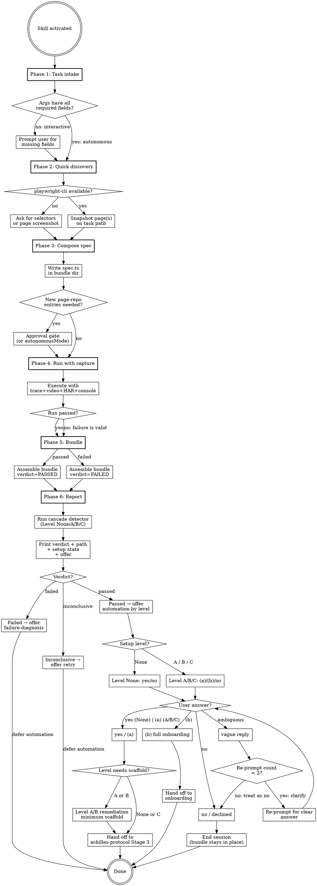

# Activation flowchart

```dot
digraph companion_mode {
    "Skill activated" [shape=doublecircle];
    "Phase 1: Task intake" [shape=box, style=bold];
    "Args have all\nrequired fields?" [shape=diamond];
    "Prompt user for\nmissing fields" [shape=box];
    "Phase 2: Quick discovery" [shape=box, style=bold];
    "playwright-cli available?" [shape=diamond];
    "Ask for selectors\nor page screenshot" [shape=box];
    "Snapshot page(s)\non task path" [shape=box];
    "Phase 3: Compose spec" [shape=box, style=bold];
    "Write spec.ts\nin bundle dir" [shape=box];
    "New page-repo\nentries needed?" [shape=diamond];
    "Approval gate\n(or autonomousMode)" [shape=box];
    "Phase 4: Run with capture" [shape=box, style=bold];
    "Execute with\ntrace+video+HAR+console" [shape=box];
    "Run passed?" [shape=diamond];
    "Phase 5: Bundle" [shape=box, style=bold];
    "Assemble bundle\nverdict=PASSED" [shape=box];
    "Assemble bundle\nverdict=FAILED" [shape=box];
    "Phase 6: Report" [shape=box, style=bold];
    "Run cascade detector\n(Level None/A/B/C)" [shape=box];
    "Print verdict + path\n+ setup state\n+ offer" [shape=box];
    "Verdict?" [shape=diamond];
    "Failed → offer\nfailure-diagnosis" [shape=box];
    "Inconclusive →\noffer retry" [shape=box];
    "Passed → offer\nautomation by level" [shape=box];
    "Setup level?" [shape=diamond];
    "Level None: yes/no" [shape=box];
    "Level A/B/C: (a)/(b)/no" [shape=box];
    "User answer?" [shape=diamond];
    "yes / (a)" [shape=box];
    "(b) full onboarding" [shape=box];
    "no / declined" [shape=box];
    "vague reply" [shape=box];
    "Re-prompt for clear\nanswer" [shape=box];
    "Level A/B remediation\nminimum scaffold" [shape=box];
    "Level needs scaffold?" [shape=diamond];
    "Hand off to\nachilles-protocol Stage 3" [shape=box];
    "Hand off to\nonboarding" [shape=box];
    "End session\n(bundle stays in place)" [shape=box];
    "Done" [shape=doublecircle];

    "Skill activated" -> "Phase 1: Task intake";
    "Phase 1: Task intake" -> "Args have all\nrequired fields?";
    "Args have all\nrequired fields?" -> "Phase 2: Quick discovery" [label="yes: autonomous"];
    "Args have all\nrequired fields?" -> "Prompt user for\nmissing fields" [label="no: interactive"];
    "Prompt user for\nmissing fields" -> "Phase 2: Quick discovery";
    "Phase 2: Quick discovery" -> "playwright-cli available?";
    "playwright-cli available?" -> "Snapshot page(s)\non task path" [label="yes"];
    "playwright-cli available?" -> "Ask for selectors\nor page screenshot" [label="no"];
    "Ask for selectors\nor page screenshot" -> "Phase 3: Compose spec";
    "Snapshot page(s)\non task path" -> "Phase 3: Compose spec";
    "Phase 3: Compose spec" -> "Write spec.ts\nin bundle dir";
    "Write spec.ts\nin bundle dir" -> "New page-repo\nentries needed?";
    "New page-repo\nentries needed?" -> "Approval gate\n(or autonomousMode)" [label="yes"];
    "Approval gate\n(or autonomousMode)" -> "Phase 4: Run with capture";
    "New page-repo\nentries needed?" -> "Phase 4: Run with capture" [label="no"];
    "Phase 4: Run with capture" -> "Execute with\ntrace+video+HAR+console";
    "Execute with\ntrace+video+HAR+console" -> "Run passed?";
    "Run passed?" -> "Phase 5: Bundle" [label="yes"];
    "Run passed?" -> "Phase 5: Bundle" [label="no: failure is valid"];
    "Phase 5: Bundle" -> "Assemble bundle\nverdict=PASSED" [label="passed"];
    "Phase 5: Bundle" -> "Assemble bundle\nverdict=FAILED" [label="failed"];
    "Assemble bundle\nverdict=PASSED" -> "Phase 6: Report";
    "Assemble bundle\nverdict=FAILED" -> "Phase 6: Report";
    "Phase 6: Report" -> "Run cascade detector\n(Level None/A/B/C)";
    "Run cascade detector\n(Level None/A/B/C)" -> "Print verdict + path\n+ setup state\n+ offer";
    "Print verdict + path\n+ setup state\n+ offer" -> "Verdict?";
    "Verdict?" -> "Failed → offer\nfailure-diagnosis" [label="failed"];
    "Verdict?" -> "Inconclusive →\noffer retry" [label="inconclusive"];
    "Verdict?" -> "Passed → offer\nautomation by level" [label="passed"];
    "Failed → offer\nfailure-diagnosis" -> "Done" [label="defer automation"];
    "Inconclusive →\noffer retry" -> "Done" [label="defer automation"];
    "Passed → offer\nautomation by level" -> "Setup level?";
    "Setup level?" -> "Level None: yes/no" [label="None"];
    "Setup level?" -> "Level A/B/C: (a)/(b)/no" [label="A / B / C"];
    "Level None: yes/no" -> "User answer?";
    "Level A/B/C: (a)/(b)/no" -> "User answer?";
    "User answer?" -> "yes / (a)" [label="yes (None) | (a) (A/B/C)"];
    "User answer?" -> "(b) full onboarding" [label="(b)"];
    "User answer?" -> "no / declined" [label="no"];
    "User answer?" -> "vague reply" [label="ambiguous"];
    "Re-prompt count\n< 2?" [shape=diamond];
    "vague reply" -> "Re-prompt count\n< 2?";
    "Re-prompt count\n< 2?" -> "Re-prompt for clear\nanswer" [label="yes: clarify"];
    "Re-prompt count\n< 2?" -> "no / declined" [label="no: treat as no"];
    "Re-prompt for clear\nanswer" -> "User answer?";
    "yes / (a)" -> "Level needs scaffold?";
    "Level needs scaffold?" -> "Level A/B remediation\nminimum scaffold" [label="A or B"];
    "Level needs scaffold?" -> "Hand off to\nachilles-protocol Stage 3" [label="None or C"];
    "Level A/B remediation\nminimum scaffold" -> "Hand off to\nachilles-protocol Stage 3";
    "(b) full onboarding" -> "Hand off to\nonboarding";
    "no / declined" -> "End session\n(bundle stays in place)";
    "Hand off to\nachilles-protocol Stage 3" -> "Done";
    "Hand off to\nonboarding" -> "Done";
    "End session\n(bundle stays in place)" -> "Done";
}
```
